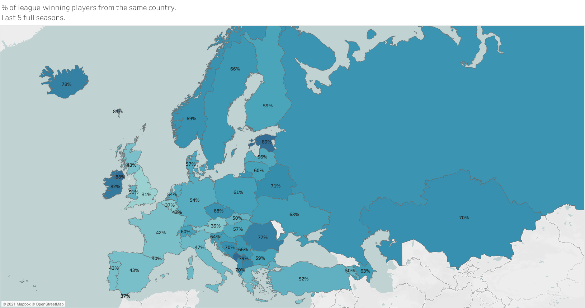

# Local Winners 
Percentage of league winning players from their own country. Last 5 years aggregated and broken down year-by-year.
Data acquired from [WorldFootball.net](https://www.worldfootball.net/continents/uefa/) using Python's **Pandas** and **BeautifulSoup** libraries.
Data cleaned using Python and Tableau. Visualisations done in Tableau Public.

Each European highest football league's winners' squadlist was collected from the last 5 full seasons (excluding Malta, Georgia and Moldova). The data is availabe year-by-year, or aggregated for the full 5 years.
Each player's nationality was recorded and later used to calculate the ratio, to see how diverse each league winning team was.

The two versions are available [here](https://public.tableau.com/app/profile/tibor.toth/viz/LeagueWinnersfromthesamecountry-5years/Sheet2) and [here](https://public.tableau.com/app/profile/tibor.toth/viz/Year-by-yearleague-winningplayersfromthesamecountry/Sheet1).

Overall it can be said, that there are 2 main cases, where teams and leagues have players from a wide range of nationalities :
- bigger, or more powerful clubs and leagues
- small nations with not enough footballers

## Teams
3 teams with the lowest percentage of local players:
- Englang 2017 (Chelsea FC) - 20.83%
- Gibraltar 2017 (Europa FC) - 22.22%
- Andorra 2019 (UE Sant Julià) - 23.08%

3 teams with the highest percentage of local players:
- Estonia 2020 (FC Flora) - 100%
- Montenegro 2021 (FK Budućnost Podgorica) - 96.77%
- Estonia 2017 (FC Flora) - 96.43%

Wales 2019 winner had interestingly high percentage of locals.

## Leagues
3 leagues with the lowest percentage of local players (2017-2021):
- England - 30.77%
- Belgium - 36.81%
- Gibraltar - 36.92%

3 leagues with the highest percentage of local players (2017-2021):
- Montenegro - 91.04%
- Estonia - 88.89%
- Northern Ireland - 87.86%

## Aggregated data from the last 5 years
 

 

## Year-by-year comparison of the leagues from 2017
 

 
